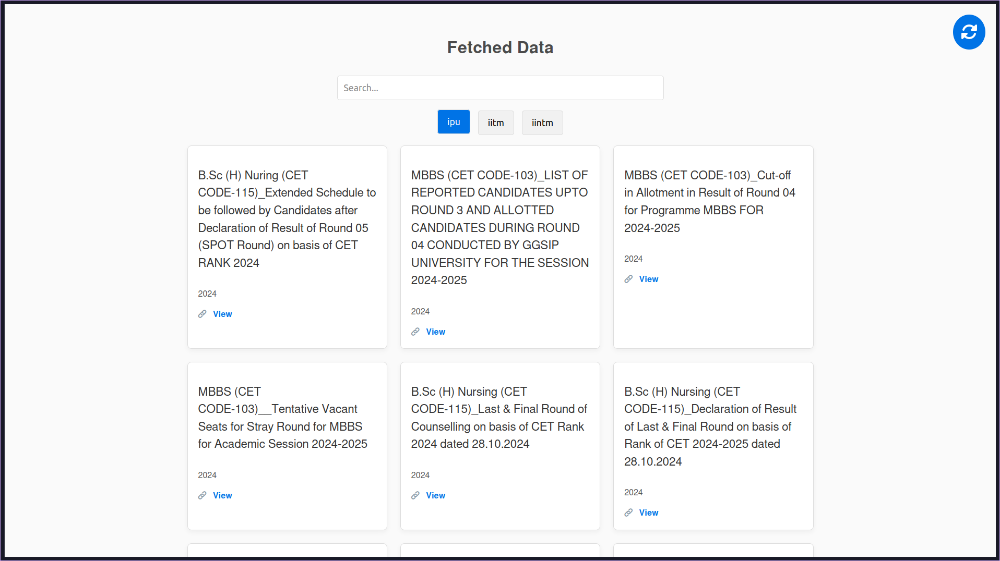
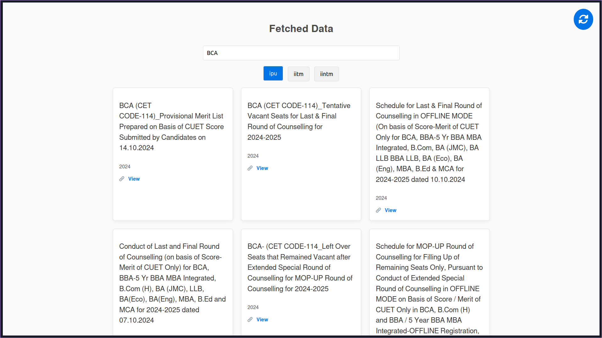

# Notification Project



## Installation

To install the necessary dependencies, run:

```bash
bun install
```

## Running the Project

To start the project, execute:

```bash
bun run index.ts
```

## Project Information

This project was created using `bun init` with bun v1.1.33. [Bun](https://bun.sh) is a fast all-in-one JavaScript runtime.

